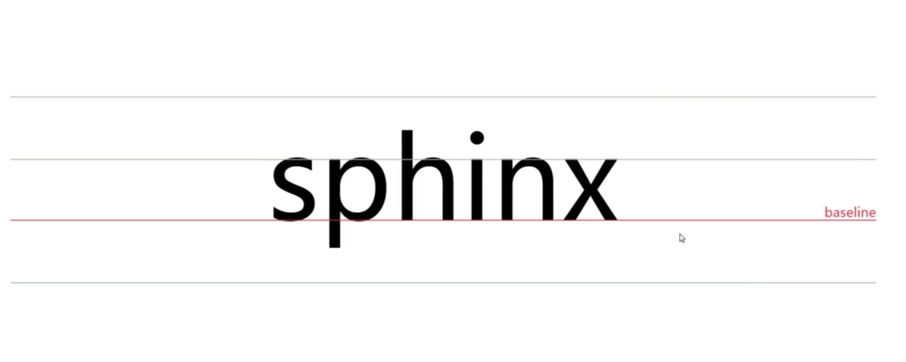
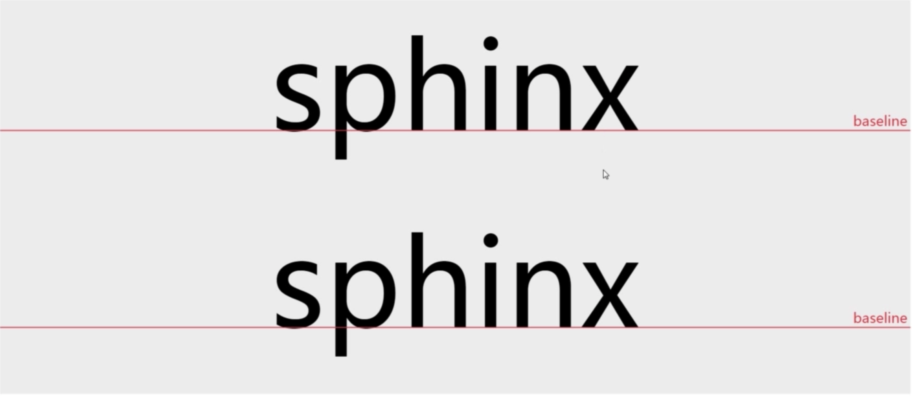

# line-height 爱我你怕了吗

<!--more-->

##  1. line-height的定义

行高：两行文字基线（baseline）之间的距离

### 什么是基线




行高



> 行高可以让单行文本垂直居中？


真的垂直居中了吗？


<iframe width="100%" height="400" src="http://jsrun.net/jdgKp/embedded/all/light" allowfullscreen="allowfullscreen" frameborder="0"></iframe>

##  2. line-height与行内框盒子模型

> 所有内联元素的样式表现都与行内框盒子模型有关

```
<p>我是字<em>我是斜体字</em>我是字我是我是字我是字我是字我是字我是字我是字我是字我是字</p>

```
1. 内容区域(content area),是一种围绕文字看不见的盒子。内容区域的大小与font-size有关

2. 内联盒子(inline boxes)不会让内容显示成块，而是排成一行 ，如果外部含有标签属于内联盒子，如果仅仅是文本择属于匿名内联盒子

3. 行框盒子(line boxes)，一行一个行框盒子，由内联盒子组成

4. 包含盒子(containing boxes),由一行行的行框盒子组成

行内框盒子对line-height的现实意义


## 3.line-height 的各类属性值

1. normal  默认属性值，跟浏览器相关 且与字体类型有关

2. <number>  1.5   根据当前元素的font-size计算

3. <length>  1.5em  使用具体长度值作为行高值

4. <percent>  150%  相对于设置了该行高属性元素的的的font-size大小计算

5. inherit  继承


<iframe width="100%" height="300" src="//jsrun.net/bFgKp/embedded/all/light/" allowfullscreen="allowfullscreen" frameborder="0"></iframe>


## 4.line-height的高度机理

<iframe width="100%" height="400" src="http://jsrun.net/BdgKp/embedded/all/light" allowfullscreen="allowfullscreen" frameborder="0"></iframe>


内容区域高度(content area)+行间距(vertical spacing) = 行高(line-height)

1. 内容区域的高度只与字号和字体有关，与行高无关

2. 内联元素的高度由内部的内容区域决定

3. inline-block 和块级元素的高度由内部内联元素的行高有关

4. 一个inline-block元素，如果里面没有inline内联元素，或者overflow不是visible，则该元素的基线就是其margin底边缘，否则，其基线就是元素里面最后一行内联元素的基线。

<iframe width="100%" height="300" src="//jsrun.net/LFgKp/embedded/all/light/" allowfullscreen="allowfullscreen" frameborder="0"></iframe>

5. 宋体字体下内容区域的高度等于字体大小

更直观的例子

<iframe width="100%" height="300" src="//jsrun.net/pFgKp/embedded/all/light/" allowfullscreen="allowfullscreen" frameborder="0"></iframe>

## 5. line-height 与 vertical-align 的关系

```
/* 关键字值 */
vertical-align: baseline;
vertical-align: sub;
vertical-align: super;
vertical-align: text-top;
vertical-align: text-bottom;
vertical-align: middle;
vertical-align: top;
vertical-align: bottom;

/* <长度> 值 */
vertical-align: 10em;
vertical-align: 4px;

/* <百分比> 值 */
vertical-align: 10%;

/* 全局值 */
vertical-align: inherit;
vertical-align: initial;
vertical-align: unset;

```

vertical-align的百分比值不是相对于字体大小或者其他什么属性计算的，而是相对于line-height计算的。举个简单的例子，如下CSS代码：

```
{
  line-height: 30px;
  vertical-align: -10%;
}
```

等同于

```
{
  line-height: 30px;
  vertical-align: -3px;    /* = 30px * -10% */
}
```


<iframe width="100%" height="300" src="//jsrun.net/vFgKp/embedded/all/light/" allowfullscreen="allowfullscreen" frameborder="0"></iframe>


真的垂直居中了吗？

<iframe width="100%" height="400" src="http://jsrun.net/jdgKp/embedded/all/light" allowfullscreen="allowfullscreen" frameborder="0"></iframe>

